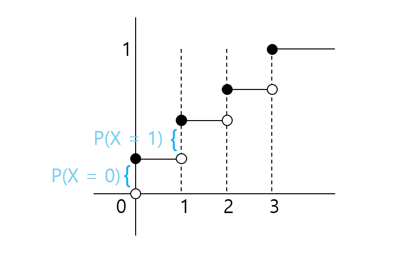

# Random Variable
## What is random variable?
Random variable is a _function_ from the sample space. Think as numeric "summary" of an aspect of the event.

A function is deterministic. Then where is randomness coming from?
Randomness is coming from random experiment.
## Definition of Bernoulli Distribution
A random variable $X$ is said to have Bernoulli distribution.

If $X$ has only 2 possible values, 0 and 1, $P(X=1)=p, \ P(X=0) = 1-p$.
'$X = 1$' means an event that $X$ actually takes the value 1.

## Binomial (n, p) Distribution
The distribution of the number of succeses $X$ in $n$ independent Bern(p) trials is called Bin(n,p). 
**KEY ASSUMTION**
1. Trials are independent.
2. Probability of success is all same.
### $X$ ~ $Bin(n,p)$, How to figure out it.
- Story: $X$ is number of successes in $n$ **independent** Bern(p) trial. (p is probability of success)
- Sum of indicator random variable.
	- $X = X_1 + X_2 + \cdots +X_n$
	- $X_j$ is 1 if $n_{th}$ trial is success, otherwise is zero.
- PMF(Probability Mass Function): $P(X=k)= _nC_k \ p^k{(1-p)}^{n-k}$ ($0 \leqq k \leqq n$)
	- descrete case.
	- $P(X=a_j) = p_j , \ (p_j \geqq 0,\ \displaystyle\sum_{j}^{}p_j = 1)$ 
### Sum of the two Binomials
$X$ ~ $(n,\ p)$ 

$Y$ ~ $(m, \ p)$

$X$ and $Y$ is independent.

$X + Y$ ~ $(m+n, \ p)$
1. $X = X_1 + \cdots + X_n, \ Y = Y_1 + \cdots + Y_m \Rightarrow X + Y = \sum_{j=1}^{n}X_j + \sum_{i=1}^{m}Y_i$
   
   Sum of $n + m$ i.i.d.(idepentent and identical distribution) Bern(p) $\Rightarrow Bin(n+m, p)$
2. $P(X+Y=k)= \sum_{j=0}^{k} P(X+Y=k|X=j)\cdot P(X=j)$
   
   $= \sum_{j=0}^{k}P(Y=k-j|X=j)\cdot _nC_jp^jq^{n-j}$
   
   $=\sum_{j=0}^{k} \ _mC_{k-j}p^{k-j}q^{m-k+j} \cdot _nC_jp^jq^{n-j}$
   
   $=p^kq^{m+n-k} \cdot _{m+n}C_k$

## CDF(누적분포함수)
### CDF
- CDF는 이산확률변수(discrete random variable)와 연속확률변수(continuous random variable) 모두에 성립한다.
- CDF: $F(x) = P(X \leqq x),\ x \in \mathbb{R}$
- 이산확률변수의 누적분포함수 그래프

  
  > 출처: [네이버 부스트코스](https://www.boostcourse.org/ai152/lecture/30901?isDesc=false)

